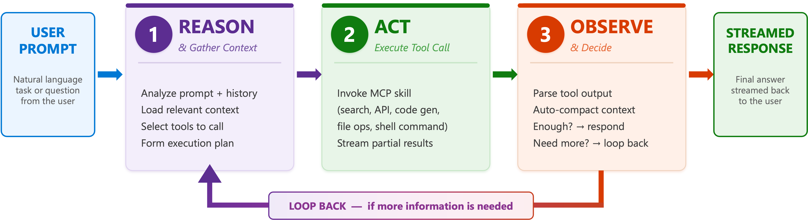
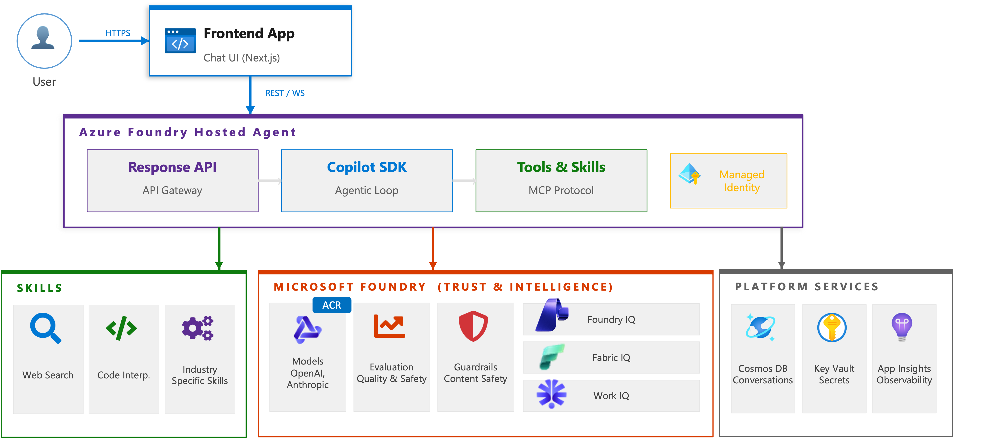
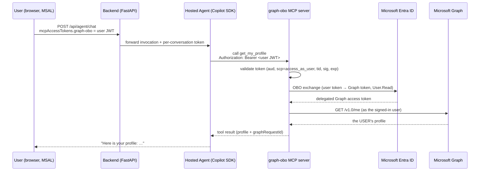

<div align="center">

# Kratos Agent

**Production-ready reference architecture for building extensible AI agents on Azure**

[](https://portal.azure.com)
[](https://github.com/features/copilot)
[](https://ai.azure.com)
[](https://modelcontextprotocol.io)
[](https://python.org)
[](https://nextjs.org)
[](LICENSE)

One-command deploy (`azd up`) provisions Azure services, builds containers, deploys a hosted agent to Microsoft Foundry, and serves a production frontend — all wired with Managed Identity, VNet isolation, and OpenTelemetry tracing. The agent calls Foundry models **directly** (no API Management gateway) and ships an **Entra On-Behalf-Of** MCP server that calls Microsoft Graph as the signed-in user.

</div>

---

## Built-in experience

Generic retains general-purpose tools and downloads. Akte Agent adds bilingual
notarial working artifacts; see [Akte intake](docs/akte-intake.md).
Agent Manager manages skills, prompts, MCP connections and APM packages.

---

## Architecture

### Why This Architecture — One Agent, N Skills

Instead of orchestrating handoffs between multiple specialized agents, Kratos uses a single agent backed by N swappable MCP skills — simpler to reason about, debug, and extend.

### Agentic Loop — Reason, Act, Observe

Each turn follows a Reason → Act → Observe cycle powered by the Copilot SDK. The agent plans its approach, invokes tools, inspects results, and iterates until it has a complete answer.

<div align="center">

</div>

### System Overview

End-to-end request flow from the frontend to the Foundry-hosted agent, which calls models directly and executes skills against platform services.

<div align="center">

</div>

### Dual-Compute Architecture

Kratos runs two compute layers that work together:

| Layer | Runtime | Purpose |
|-------|---------|---------|
| **Hosted Agent** | Microsoft Foundry (auto-scaled, Invocations protocol, port 8088) | Runs the Copilot SDK agentic loop, executes skills, calls models |
| **Backend Proxy** | Azure Container Apps (FastAPI, port 8000) | Frontend API, conversation persistence, file serving, admin endpoints |

The backend proxies all chat requests to the Foundry hosted agent via the Invocations REST API and streams SSE events back to the frontend. Agent session pinning (`x-agent-session-id` header) ensures multi-turn conversations route to the same agent container, preserving in-memory SDK state.

### Core Pillars

| Pillar | Technology | Role |
|--------|------------|------|
| **Engine** | [GitHub Copilot SDK](https://github.com/features/copilot) `1.0.14` | Agentic loop — Plan → Act → Observe → Iterate |
| **Platform** | [Microsoft Foundry](https://ai.azure.com) | Hosted agent lifecycle, model hosting, evaluation, guardrails |
| **Extensibility** | [MCP Skills Protocol](https://modelcontextprotocol.io) | Portable, standard tool interface for agent capabilities |
| **Persistence** | [Azure Cosmos DB](https://learn.microsoft.com/azure/cosmos-db/) | Conversations, messages, settings, session mappings |
| **Observability** | [OpenTelemetry](https://opentelemetry.io) + Foundry Traces | End-to-end tracing with GenAI semantic conventions |

---

## Bilingual chat foundation

The curated **Akte Agent** persona adds bilingual notarial intake, draft follow-up
and exact downloadable time records alongside the unchanged Generic default.
See [Akte intake and timekeeping](docs/akte-intake.md) for the delivered draft-only
slice, evidence boundaries, reusable helpers and temporary-download limitations.
Stage 4/5 [execution preparation and reconciliation](docs/akte-execution.md)
adds human-check questions, attributed observations, supplied-deed explanations
and exact client-funds worksheets; official actions remain human/external.
Stage 6 [billing and dossier handoff](docs/akte-handoff.md) adds registration
preparation, exact itemized invoice drafts and correction-aware inventories.
Missing official evidence remains pending; chat history is not a legal archive.

The language selector supports English and Nederlands. A valid saved
`kratos.locale` preference wins over the first supported browser language;
otherwise English is used. Storage is optional. Changing language keeps the
persona, conversation, history, draft and attachments; it does not translate
source material or historical messages.

For additional localized screens, use `useLocale()` from
`src/frontend/src/components/LocaleProvider.tsx`, already mounted in the root
layout. It exposes `locale`, `setLocale`, `ready`, typed `t(key, params)`,
`formatDate`, `formatNumber` (including Intl currency options),
`formatRelativeTime`, and `formatDuration`. Add matching keys and interpolation
parameters to both catalogs in `src/frontend/src/lib/i18n.ts`; do not introduce
another locale store or selector. `ready` indicates client preference resolution,
not completion of API loading. Keep state keyed by conversation/persona, not
language. `lib/errors.ts` provides stable application error codes; render
`t(\`error.${code}\`)` instead of exposing raw service diagnostics.

`localizeUseCase(persona, locale)` overlays optional `localizations.en` / `.nl`
presentation fields on the existing scalar fields. Missing fields retain the
original value; explicit empty values are retained. Discovery stays dynamic and
the chat selector defaults to curated personas. Generic includes both complete
translations. Authenticated import, prompt editing and ZIP export preserve
metadata; body-only prompt edits retain frontmatter, while full-frontmatter
edits can intentionally replace the localization map.

`POST /api/agent/chat` and `POST /api/copilot-studio/chat` accept optional
`locale: "en" | "nl"`. Omission leaves the old language behavior unchanged;
unsupported values return validation errors. The UI sends locale every turn.
The proxy carries locale and conversation identity in gateway-compatible input
context as well as JSON. The hosted runtime applies a per-turn language default
without recreating the SDK session. Explicit output-language requests take
precedence, do not change jurisdiction, and follow-up generation is instructed
to follow the response language (UI locale is only a fallback).

The foundation covers landing, chat, sidebar, files, persona import, prompt
editing and export. Akte Agent is the application-facing identity; Generic
Assistant keeps its own persona identity. Runtime/service names, telemetry,
environment variables, `kratos.locale` and embedding contracts remain unchanged.

### Configuration localization inventory

| Surface | English/Dutch coverage |
|---------|------------------------|
| AI service settings | Labels, status, loading, save/error guidance, cancellation and accessible dialog/field names |
| Application-owned OBO controls | Optional sign-in/out, busy state, account name and safe failure guidance; external identity-provider pages are unchanged |
| Themes | Picker, descriptions, mode controls and accessible names; theme names stay identifiers |
| How it works | All eleven steps, illustrations, navigation, keyboard hints and accessible names; examples are explanatory, not live checks |
| Agent Manager | Navigation, persona selection, counts, system-prompt and deployment controls; [evaluation and trace journeys](#evals--tracing) |
| Skills and files | Create/edit/toggle/delete, instructions, text-file editing/upload/delete, confirmations, loading/empty/error/success states and accessible controls |
| MCP | Local/HTTP/SSE configuration, fields, validation, save/delete confirmations and safe errors |
| APM | Discovery, install/update/sync/removal, MCP packages, confirmations, status, errors, duration formatting and output controls |
| Consistency | Controls, category/severity labels, progress, summary counts/durations and safe fix failures; generated analysis text remains source content |

These surfaces use the same typed catalogs and provider. Locale changes do not
remount editors, reset forms or trigger API mutations. User instructions,
prompt metadata, file contents, technical package/tool identifiers, third-party
names and raw command output are not translated. Locally authored package
recommendation descriptions are translated; failed command output is kept
separate from localized guidance and initially collapsed.

The backend currently exposes **GET-only `/api/settings`**. The existing UI
save request is retained for compatible backends; this backend returns 405 and
the UI explains that deployment configuration is read-only, without claiming
anything was saved. This localization does not introduce configuration
persistence or change authorization. Settings changes on this backend remain
an administrator's environment-configuration task.

Deterministic browser coverage lives in the existing
`.copilot/skills/e2e-smoke/tests/09-locale.spec.ts` harness. Serve a local static
frontend export, set `KRATOS_FRONTEND_URL` and `KRATOS_BACKEND_URL` to that local
origin, and run `npx playwright test tests/09-locale.spec.ts --project=browser`
from the harness directory. The same tests support a `NEXT_PUBLIC_BASE_PATH`
build and matching mounted frontend URL. API/model responses are intercepted
synthetic fixtures; these tests do **not** establish live-model language quality.
Backend transport and metadata checks are in `test_locale_contracts.py`,
`test_import_persona.py`, and `test_project_exporter.py`. No deployment or
credentials are required for these checks.

Configuration browser acceptance is in `10-settings-locale.spec.ts`, in the
same harness. Run it alongside `09-locale.spec.ts` for both language journeys,
unsaved-state preservation, file CRUD, MCP/package operations, cancellations,
optional OBO failure guidance and help/theme coverage. Both files support root
and base-path exports. API responses, including settings-save success, package
installation and analysis, are controlled synthetic fixtures: they do **not**
establish live persistence, package installation or successful Entra sign-in.

## Tech Stack

### Backend

| Component | Technology | Version |
|-----------|-----------|---------|
| Language | Python | 3.11 |
| Web framework | FastAPI + uvicorn | ≥0.115 |
| Agent SDK | `github-copilot-sdk` | 1.0.14 |
| Agent runtime | Copilot CLI (`@github/copilot`) | latest |
| Hosted agent protocol | `azure-ai-agentserver-invocations` | ≥1.0.0b3 |
| Database | Azure Cosmos DB (serverless) / SQLite (local) | — |
| Blob storage | Azure Storage / Azurite (local) | — |
| PDF rendering | Playwright Chromium | — |
| Telemetry | OpenTelemetry + Azure Monitor Exporter | — |
| Package manager | APM CLI (`apm-cli`) | ≥0.5.0 |

### Frontend

| Component | Technology | Version |
|-----------|-----------|---------|
| Framework | Next.js (static export) | 16 |
| UI | React + Tailwind CSS | 19 / 4 |
| Auth | MSAL Browser / React (Azure AD) | 4 / 3 |
| Type checking | TypeScript native compiler | 7 |
| Markdown | react-markdown + remark-gfm | 10 / 4 |
| Hosting | Azure Static Web Apps | — |

`npm run typecheck` invokes TypeScript 7 explicitly through the
`typescript-native` package alias; `npm run build` runs it before exporting.
TypeScript 6 remains installed for ESLint and Next.js tooling that use its
JavaScript compiler API, which TypeScript 7 no longer provides. Use the npm
scripts rather than `npx tsc`, since both packages expose a `tsc` executable.
Linting uses ESLint's flat configuration (`npm run lint`), not `next lint`.

Tailwind 4 uses `@tailwindcss/postcss`, with theme tokens and animations in
`src/frontend/src/app/globals.css`. `npm run test:styles` checks generated
semantic utilities, manual dark mode, typography and theme variable aliases;
it also runs during builds. Supported browsers: Safari 16.4+, Chrome 111+,
Firefox 128+. ESLint stays on 9 until the Next.js Babel parser and React plugin
support 10; OBO's Pydantic/core pins must match Pydantic's exact requirement.

### Infrastructure (Bicep)

Azure services provisioned via `azd up`:

> VNet · Container Apps Environment · Container Apps (backend proxy **+** OBO MCP server) · Container Registry · Static Web App · AI Services (Foundry — agent calls models **directly**, no APIM) · Cosmos DB · Blob Storage · Key Vault · App Insights · Log Analytics · Bing Search · Entra OBO app registrations + user-assigned managed identity · RBAC Role Assignments

---

## Quick Start

### Prerequisites

- [Azure Developer CLI (azd)](https://learn.microsoft.com/azure/developer/azure-developer-cli/) ≥1.12
- [Azure CLI](https://learn.microsoft.com/cli/azure/)
- [Docker](https://www.docker.com/)
- [Node.js 20.9+](https://nodejs.org/)
- [Python 3.11+](https://www.python.org/)

### Deploy to Azure

```bash
git clone https://github.com/aiappsgbb/kratos-agent && cd kratos-agent
azd up
```

This single command:
1. Provisions all Azure infrastructure via Bicep (VNet, Cosmos DB, AI Services, OBO MCP server, etc.)
2. Builds Docker images for the backend and hosted agent
3. Pushes images to Azure Container Registry
4. Deploys the backend and the Entra OBO MCP server to Container Apps
5. Deploys the hosted agent to Microsoft Foundry (via `azd ai agent` extension)
6. Exports the frontend as a static site and deploys to Static Web Apps
7. Configures all Managed Identity role assignments
8. Outputs the public URL

The Foundry project endpoint is read from the project's `AI Foundry API`
endpoint, not assembled from the account's Cognitive Services endpoint.
Provisioning exports it as both `AZURE_AI_PROJECT_ENDPOINT` and
`FOUNDRY_PROJECT_ENDPOINT` for the hosted-agent CLI and backend.

### Running Multiple Environments

`azd` supports any number of side-by-side environments, so a throwaway experiment never has to share infrastructure with a live deployment. Each one lives in its own directory under `.azure/` (gitignored, so environments stay local and are never committed).

```bash
azd env list                          # show all environments; DEFAULT marks the active one
azd env new <experiment-env>          # create a new one (becomes active immediately)
azd env select <prod-env>             # switch back
azd env get-value AZURE_ENV_NAME      # confirm which one is active right now
```

Environments are fully isolated. `infra/main.bicep` derives its resource token from
`uniqueString(subscription().id, environmentName, location)` and deploys into `rg-<environmentName>`,
so a second environment gets its own resource group and its own uniquely-named resources with no
risk of collision.

> [!WARNING]
> `azd env select` sets a **global** default. `azd up`, `azd deploy`, `azd down` and the
> `e2e-smoke` runner all silently follow whichever environment is active. Confirm with
> `azd env get-value AZURE_ENV_NAME` before deploying or destroying anything, or bypass the
> default entirely by naming the target per command: `azd deploy -e <experiment-env>`.
> `-e` works on `up`, `deploy` and `down`, and is the safer habit once more than one
> environment exists.

The environment name is permanent in practice: it feeds both the resource group name and the
resource-name hash, so renaming one means reprovisioning it from scratch.

Per-environment settings are set with `azd env set` while that environment is active — for example
`azd env set DEPLOY_OBO false` to skip the on-behalf-of stack in an experiment. Values set this way
land in that environment's `.env` only, never in another's.

### Azure SRE Agent (opt-in)

An environment can opt into a read-only [Azure SRE Agent](https://learn.microsoft.com/azure/sre-agent/)
that observes that environment's resources and reuses its Application Insights and Log Analytics.
It is off by default: environments never opted in create no billable SRE resource.
Workload telemetry connectors and their read-only permissions are configured
after core provisioning by default, alongside optional GitHub Code Access
registration. Query and current source access remain `pending` until verified
through SRE. For an explicit **core-only** deployment:

```bash
azd env set DEPLOY_SRE_AGENT true
azd env set SRE_CONNECT_TELEMETRY false
azd env set SRE_CONNECT_GITHUB false
azd provision
```

See [`docs/sre-agent.md`](./docs/sre-agent.md) for prerequisites, supported-region checks,
permissions, outputs, cost, and cleanup (turning the flag off does **not** delete an existing agent).

### Register the Agent in Foundry (One-Time Manual Step)

After `azd up`, register the agent in the Foundry portal so traces appear in the Operate tab:

1. Open [Microsoft Foundry](https://ai.azure.com) → your project → **Operate** → **Agents**
2. Click **+ Register agent** (Custom Agent)
3. Set **Name** to `kratos-agent`, enter the backend Container App URL as the agent endpoint, and `kratos-agent` as the API path
4. Complete the wizard

> **Tip:** `azd env get-values | grep AGENT_SERVICE` shows the backend Container App URL.

This is the only manual step. Traces appear automatically: the deployment connects Application Insights to the Foundry **project**, so the hosted agent emits OpenTelemetry spans that surface in the **Traces** tab (see [Foundry Traces](#foundry-traces)).

### Validating a Deployment

The repo ships a Playwright-based smoke skill at `.copilot/skills/e2e-smoke/` that asserts the **21 critical surfaces** (health, scenarios, chat, evals, traces, UI, regression, interactive UX) of a deployed instance in ~55s. After every deploy:

```bash
cd .copilot/skills/e2e-smoke
./run.sh                 # resolves the target from the selected azd environment
SKIP_BROWSER=1 ./run.sh  # API-only, skips the Chromium download
```

`run.sh` reads `AZURE_STATIC_WEB_APP_URL` and `AGENT_SERVICE_URL` from `azd env get-values`, so it always follows whichever environment is currently selected. Override with `KRATOS_FRONTEND_URL` / `KRATOS_BACKEND_URL` to point it elsewhere. It fails fast rather than falling back to a stale default.

See [`.copilot/skills/e2e-smoke/SKILL.md`](./.copilot/skills/e2e-smoke/SKILL.md) for the spec catalogue, env-var reference, and tips for running just the API or just the UX project.

---

## Local Development

### Local Mode

Run compute and storage on your laptop. A GitHub Copilot token replaces Foundry models, SQLite replaces Cosmos DB, and Azurite replaces Blob Storage. The OBO MCP server still requires Entra app registrations and a local client secret.

```bash
# First run creates .env.local with empty values and exits.
# Fill in the Copilot token and Entra OBO configuration, then run again.
./run-local.sh          # or .\run-local.ps1 on Windows
```

Set `COPILOT_GITHUB_TOKEN`, `AZURE_TENANT_ID`, `OBO_API_CLIENT_ID`,
`OBO_CLIENT_SECRET`, and `ALLOWED_CLIENT_APP_IDS` in `.env.local`.
`ALLOWED_CLIENT_APP_IDS` must identify your permitted client app(s).
Environment files are local-only and excluded from Git.

| Service | URL | Notes |
|---------|-----|-------|
| Backend | `http://localhost:8000` | FastAPI + Copilot SDK |
| Azurite | `http://localhost:10000` | Local blob emulator |
| Frontend | `http://localhost:3000` | `cd src/frontend && npm install && npm run dev` |

**Auto-detection:** `LOCAL_MODE` activates whenever `COSMOS_DB_ENDPOINT` is empty. The same codebase runs in both environments without code changes.

**Persistent data:**
- `.local/backend/kratos.db` — SQLite (conversations, messages, settings, sessions)
- `.local/azurite/` — Emulated blob storage (skills, APM manifests)
- `use-cases/` — Bind-mounted; edits on host appear immediately

### Development Against Azure

```bash
# Backend (connects to Azure services via env vars)
cd src/backend
pip install -e ".[dev]"
uvicorn app.main:app --reload --port 8000

# Frontend
cd src/frontend
npm install && npm run dev
```

---

## How It Works

### Request Flow

```
1. User sends message via frontend
2. POST /api/agent/chat → Backend (FastAPI)
3. Backend looks up the agent session ID for the conversation
4. Backend forwards to Foundry hosted agent via Invocations REST API
5. Hosted agent runs CopilotClient agentic loop:
   a. Load system prompt + use-case skills
   b. Call model (GPT-4o / GPT-5) with tools
   c. Execute tool calls (MCP skills, code interpreter, RAG, etc.)
   d. Iterate until the model produces a final response
6. Hosted agent streams SSE events back through the proxy
7. Backend persists messages to Cosmos DB
8. Frontend renders streaming response with live execution details
```

### Event Streaming (SSE)

The agent streams structured events to the frontend in real-time:

| Event | Purpose |
|-------|---------|
| `thought` | Agent reasoning and planning steps |
| `tool_call` | Skill invocations (started → completed/failed) |
| `content` | Response text chunks |
| `usage` | Token consumption (prompt, completion, reasoning) |
| `done` | Completion signal with execution metrics |
| `error` | Error details |

### Entra On-Behalf-Of (OBO) — the agent acts as the signed-in user

Most agent tools run as the **agent's own** identity (its managed identity / API
keys). That is the right model for shared resources, but it cannot answer
"what does *Microsoft Graph* return for **me**?" without the agent impersonating
the user — which is exactly what a delegated **On-Behalf-Of** flow is for.

This sample ships a dedicated, Entra-protected MCP server — **`graph-obo`**
(`src/obo-mcp-server/`) — that exposes a `get_my_profile` tool. When the agent
calls it, the tool runs **as the signed-in user**: it performs an Entra OBO token
exchange and calls `GET https://graph.microsoft.com/v1.0/me`, returning the
*user's own* profile (display name, UPN, Entra object id, job title, office,
profile photo, and Graph-only proof fields like `graphRequestId`).

#### The token's journey (user identity, end to end)

```
1. Frontend (MSAL): user signs in; acquireTokenSilent for the OBO API scope
   api://<obo-server-app-id>/access_as_user  →  a delegated USER access token.
2. POST /api/agent/chat carries the token in the body:
   { "message": "...", "mcpAccessTokens": { "graph-obo": "<user JWT>" } }
   (NOT the Authorization header, which carries the app/session auth.)
3. Backend forwards the per-conversation token to the Foundry hosted agent.
4. Hosted agent (CopilotAgent._apply_mcp_tokens) injects it as the
   Authorization: Bearer header ONLY on the matching remote MCP server
   (graph-obo) for THIS conversation — so the model never sees the raw token.
5. graph-obo MCP server validates the inbound user token (audience, scope
   = access_as_user, tenant, signature, expiry), then performs the Entra OBO
   exchange and calls Graph /me AS THE USER.
6. The user's profile flows back as the tool result; the agent summarises it.
```



#### How the MCP server proves its own identity (no secrets in the cloud)

The OBO exchange needs the server to authenticate **itself** to Entra as the
confidential client. In the cloud this is **secret-less**: a **Federated
Identity Credential (FIC)** lets the server's **user-assigned managed identity**
mint the client assertion — no client secret is ever stored. Locally (docker
compose) the same app registration falls back to a `OBO_CLIENT_SECRET` so you
can run the identical flow on your laptop.

| Aspect | Cloud (Container App) | Local (docker compose) |
|--------|----------------------|------------------------|
| Server → Entra auth | FIC → user-assigned managed identity (no secret) | `OBO_CLIENT_SECRET` (dev only) |
| Inbound token validation | identical (aud / `access_as_user` / tenant / sig / exp) | identical |
| Graph call | `GET /me` as the user, `User.Read` | same |

#### Why it is safe (the guardrails that matter)

> **Important:** the raw user token is treated as a secret. It is injected as the
> `Authorization` header **only** on the `graph-obo` MCP server, **only** for the
> conversation it belongs to, and is **stripped from anything the model sees** —
> the model receives `hasProfilePhoto: true`, never the token or photo bytes.

- **Confused-deputy guard:** `ALLOWED_CLIENT_APP_IDS` restricts which client app
  may act on the user's behalf — a token minted by a different app is rejected.
- **Audience/scope pinning:** the server only accepts tokens whose audience is
  its own API and whose scope contains `access_as_user`.
- **Least privilege:** the Graph token is scoped to `User.Read` only.

#### Try it

After deploying (or running the local stack), sign in with the
**"Sign in (On-Behalf-Of)"** button, then ask:

```
Use the graph-obo tool to look me up and report my displayName,
userPrincipalName, id, jobTitle and officeLocation.
```

The agent calls `graph-obo-get_my_profile` and reports **your** Graph profile —
proof the tool ran with your delegated identity, not the agent's.

See [`src/obo-mcp-server/`](src/obo-mcp-server/) (`obo.py`, `server.py`) for the
validation + exchange, and `CopilotAgent._apply_mcp_tokens` in
[`src/backend/app/services/copilot_agent.py`](src/backend/app/services/copilot_agent.py)
for the per-conversation header injection.

### Session Pinning

Multi-turn conversations require routing to the same hosted agent container to preserve in-memory SDK state:

1. First invocation → Foundry returns `x-agent-session-id` response header
2. Backend stores the mapping in Cosmos DB (`sessions` container, partitioned by `conversationId`)
3. Subsequent messages → Backend appends `?agent_session_id=<id>` to the Invocations URL
4. Foundry routes to the same container instance

### Copilot SDK Integration

The `CopilotAgent` class wraps the GitHub Copilot SDK:

```python
from copilot import CopilotClient
from copilot.tools import define_tool

# Agent manages sessions per conversation
client = CopilotClient(...)
async for event in client.run(message=msg, session_id=conv_id):
    # Translate SDK events → SSE events (content, thoughts, tool_calls, usage)
```

- **Auth:** `ChainedTokenCredential` (ManagedIdentity → AzureCLI) with `get_bearer_token_provider` for keyless model access
- **Multi-use-case:** Each use case gets its own `SkillRegistry` and system prompt; selected per conversation
- **Session resume:** SDK sessions are keyed by `conversation_id`; agent session pinning ensures the same container handles all turns

---

## Use Cases

Kratos ships with two curated agent personas, each with its own system prompt, skills, and APM manifest:

| Use Case | Directory | Description |
|----------|-----------|-------------|
| **Generic** | `use-cases/generic/` | General-purpose assistant with web search, code interpreter, file sharing |
| **Akte Agent** | `use-cases/akte-agent/` | Bilingual notarial intake, exact time calculations and downloadable working artifacts |

The dynamic catalog still supports authenticated custom imports. This is a
bundled set, not an allowlist for installed personas.

### Non-destructive retirement

The nine former industry built-ins are retired by identifier in
`src/backend/app/personas.py`. Startup, blob discovery, local fallback, cached
registries, hosted lazy loading, chat, admin changes and export ignore or reject
those identifiers even if old copies remain. Requests return
`PERSONA_UNAVAILABLE` (HTTP 410 for retired identifiers); no Generic substitution
occurs. Unknown identifiers return the same code with HTTP 404.

Historical conversations remain readable, including stored messages and existing
file links. The UI explains unavailability in English or Dutch and offers an
explicit new-conversation action. Existing evaluation run/results and trace reads
remain available; new runs and scenario generation for retired personas do not.
No migration rewrites or deletes stored conversations, messages, files or evals.
Downloads remain temporary, not archival storage.

This is runtime retirement, **not physical cloud cleanup**. Old blobs may remain
and cannot reactivate a built-in. Deleting cloud copies requires separate approval;
no cleanup or deployment runs automatically. Update both runtime images together
when deployment is separately authorized. Imported personas with unrelated names,
curation, auth, remote builds and optional services retain their existing behavior.

Search ingestion requires an explicit `PDF_INGEST_FOLDER` or `--folder`; there is
no default to a former persona's sample data.

Each use case has:
- `SYSTEM_PROMPT.md` — Agent persona and behavior instructions
- `skills/` — Domain-specific MCP skills (SKILL.md files)
- `apm.yml` + `apm.lock.yaml` — Remote skill dependencies

Switch use cases per conversation via the frontend dropdown or `useCase` field in the API request.

### Export a use case as a standalone Foundry Hosted Agent

Each persona can be downloaded as a self-contained ZIP that ships everything
needed to deploy the *same* agent into a different Azure subscription as a
[Microsoft Foundry Hosted Agent](https://learn.microsoft.com/azure/ai-foundry/agents/):

* `copilot-instructions.md` — the persona's system prompt
* `skills/` — every SKILL.md and supporting script/asset
* `mcp-config.json` — the persona's MCP server map
* `main.py` — a ~300-LoC single-tenant runtime (Copilot SDK + Foundry `InvocationAgentServerHost`)
* `Dockerfile`, `pyproject.toml`, `agent.yaml`, `azure.yaml`, `infra/` (Bicep)

Trigger from the UI ("Download as Foundry Agent" under the persona picker)
or directly via the API:

```bash
curl -OJ http://localhost:8000/api/use-cases/akte-agent/export
# → akte-agent-foundry-agent.zip

unzip akte-agent-foundry-agent.zip && cd akte-agent-agent
azd auth login && azd env new my-akte-agent && azd up
```

The exported agent surfaces in the target Foundry project alongside any
other hosted agents — no Kratos backend required at runtime.

---

## Skills & MCP Protocol

Skills extend the agent's capabilities using the [Model Context Protocol](https://modelcontextprotocol.io). Each skill is a directory with a `SKILL.md` file containing YAML frontmatter and natural-language instructions.

### Skill Format

```yaml
---
name: account-lookup
description: Retrieves customer account information
enabled: true
---

## Instructions
When the user asks about their account balance or account details...

## Supported Parameters
- account_id: The customer's account identifier

## Example
User: "What's my account balance?"
→ Call account_lookup with the user's account ID
```

### Skill Loading Architecture

Skills load from three sources in priority order:

1. **Blob Storage** (primary) — `use-cases/{use-case}/skills/{name}/SKILL.md`
2. **Local filesystem** (fallback) — Same path, read directly from disk
3. **APM packages** (supplementary) — Materialised into `.github/skills/` by `apm install`

Local/blob skills always win on name conflict with APM packages.

### Adding a Custom Skill

1. Create `use-cases/{use-case}/skills/my-skill/SKILL.md`
2. Upload to blob storage via the admin API: `POST /api/admin/skills?use_case={use-case}`
3. The skill is available immediately — no redeploy needed

### MCP Servers

External MCP servers (e.g., `faker-mcp-server`) are configured per use case via `use-cases/{use-case}/.mcp.json` and managed through the admin API at `/api/admin/mcp-servers?use_case={use-case}`.

---

## APM — Agent Package Manager

[APM](https://microsoft.github.io/apm/) is a dependency manager for agent primitives — skills, prompts, MCP servers, and plugins. Think `package.json` for agents.

Each use case has a manifest at `use-cases/{name}/apm.yml`:

```yaml
name: kratos-generic
version: 1.0.0
target: copilot
dependencies:
  apm:
    - microsoft/apm-sample-package#v1.0.0
    - anthropics/skills/skills/frontend-design
  mcp: []
```

### Runtime Management

```bash
# Install a remote plugin (no redeploy needed)
curl -X POST https://<agent>/api/admin/use-cases/generic/apm/install \
  -H "Content-Type: application/json" \
  -d '{"package": "anthropics/skills/skills/frontend-design"}'

# Sync all dependencies from manifest
curl -X POST https://<agent>/api/admin/use-cases/generic/apm/sync
```

| Method | Endpoint | Purpose |
|--------|----------|---------|
| `GET` | `/api/admin/use-cases/{uc}/apm` | List dependencies + lockfile |
| `POST` | `/api/admin/use-cases/{uc}/apm/install` | Install a package |
| `DELETE` | `/api/admin/use-cases/{uc}/apm/{package}` | Uninstall a package |
| `POST` | `/api/admin/use-cases/{uc}/apm/sync` | Full resync from manifest |
| `POST` | `/api/admin/use-cases/{uc}/apm/update` | Update lockfile to latest refs |

### Security

`apm install` runs a content audit (hidden Unicode detection, known-bad package hashes) before materialising files. Diagnostics are surfaced in the admin API response.

---

## File Sharing

The agent can create files (CSVs, PDFs, charts, code) and share them with users via download links.

### How It Works

1. **Skill instructions** guide the agent to write files to `/tmp` and reference the path in the response
2. **Hosted agent** detects `/tmp/` file paths in the response, reads the files, and streams them as base64-encoded `file_content` SSE events
3. **Backend proxy** intercepts these events, decodes the base64 content, and saves files to its own `/tmp`
4. **Frontend** detects `/tmp/` paths in markdown and rewrites them as download links pointing to `GET /api/files/download/{filename}?path=/tmp/{filename}`

This SSE streaming approach solves the cross-container file sharing problem — the hosted agent (Foundry-managed, outside VNet) cannot directly access the storage account (private endpoint only), so files are streamed through the existing SSE channel instead.

---

## Observability

### OpenTelemetry

Full-stack instrumentation following [GenAI semantic conventions](https://opentelemetry.io/docs/specs/semconv/gen-ai/):

| Layer | Instrumentation |
|-------|----------------|
| HTTP | `FastAPIInstrumentor` — request/response tracing |
| Models | `OpenAIInstrumentor` (openai-v2) — LLM call tracing |
| Agent | Custom spans for `invoke_agent`, `execute_tool` |
| Logs | Python logging bridge → OTel Logs → App Insights |

**Exporters:** `AzureMonitorTraceExporter`, `AzureMonitorMetricExporter`, `AzureMonitorLogExporter`

**Custom metrics:**
- `gen_ai.client.token.usage` — histogram for input/output token counts
- `gen_ai.client.operation.duration` — histogram for operation latency

### Foundry Traces

Traces come from the application's **OpenTelemetry** instrumentation exporting to Application Insights — **not** from any gateway. The Foundry **Traces** tab lights up because the deployment connects the Application Insights resource to the Foundry **project** (an `appinsights` project connection provisioned in `infra/modules/ai-services.bicep`). Once connected, Foundry injects the App Insights connection string into the hosted-agent sandbox and reads the spans back, displaying end-to-end agent execution traces including:

- User messages and agent responses
- Tool/skill invocations with inputs and outputs
- Token consumption per model call
- Latency breakdown (time-to-first-token, model latency, total duration)

### Frontend Execution Details

The UI shows real-time execution details per message:

- **Tool pills** — Live status (started → completed/failed) during streaming
- **Metrics grid** — Total time, first token latency, model latency, tool call count
- **Token usage bar** — Prompt / reasoning / output breakdown
- **Execution flow timeline** — Thoughts connected with arrows
- **Tool I/O** — Expandable input/output for each completed tool call

---

## Evals & Tracing

Per-use-case evaluation harness and an App-Insights waterfall trace inspector — both surfaced as admin tabs in the UI and exposed via CLI for CI.

Evaluation controls, scenario generation/review, results and trace inspection use
the shared English/Dutch selector. Switching language keeps drafts, selected
results, trace filters and ongoing requests intact. Persona labels come from the
dynamic catalog; imported personas without translations keep their original label.
Dates, durations, counts and scores use locale formatting. Scenario content,
evaluator identifiers, model/tool output and raw logs are not translated.

Failures show safe translated guidance and stable error codes. Evaluation
diagnostics remain available in explicitly labeled, untranslated detail sections;
failed trace-detail requests never substitute summary data as a successful result.
Generation reviews validate required fields, preserve unsaved drafts on failure,
and retain successfully saved scenarios if a later save fails.

Deterministic coverage is in
`.copilot/skills/e2e-smoke/tests/10-eval-trace.spec.ts`, separate from persona
stage-evaluation fixtures. Serve a local frontend export, point
`KRATOS_FRONTEND_URL` and `KRATOS_BACKEND_URL` at that local origin, then run
`npx playwright test tests/10-eval-trace.spec.ts --project=browser` from the smoke
harness. The same suite supports a `NEXT_PUBLIC_BASE_PATH` build and matching
mounted URL. These synthetic API fixtures prove UI behavior, **not live model
quality or cloud connectivity**.

### Per-Use-Case Eval Scenarios

Each use-case carries its own eval suite under `use-cases/<name>/evals/`:

```
use-cases/akte-agent/evals/
  eval_config.json          ← evaluator list + judge model
  scenarios/                ← committed JSON scenarios
    load-customer-profile.json
    policy-wording-lookup.json
    ...
  results/                  ← run output (gitignored)
```

Each scenario declares an `input_message`, `expected_behavior`, `expected_tool_calls`, and the Foundry evaluator set to apply (e.g. `Relevance`, `Coherence`, `TaskAdherence`, `IntentResolution`, `ToolCallAccuracy`).

### Two Eval Modes

| Mode | Pattern | Speed | Use |
|------|---------|-------|-----|
| **validation** | In-process: invoke agent sequentially → score locally with `azure-ai-evaluation` evaluators | Seconds | Fast feedback loop, CI smoke |
| **foundry** | Full Foundry eval pipeline (same evaluators, hosted scoring) | Minutes | Pre-release runs, shareable Foundry portal links |

Both modes follow the **two-phase invoke + score** pattern from the `foundry-evals` awesome-gbb skill: Phase 1 invokes the hosted agent via `AIProjectClient(...).get_openai_client(agent_name=...)` with a warmup retry loop for cold starts; Phase 2 scores the recorded turns with the evaluators configured in `eval_config.json`.

### LLM-Generated Scenarios

The "Generate Scenarios" modal (or `POST /api/use-cases/{uc}/evals/scenarios/generate`) reads the use-case `SYSTEM_PROMPT.md` and the loaded skill catalog and asks the judge model to draft realistic conversations that exercise the agent. Each draft is hand-reviewable before commit. Generation uses the selected persona and optional administrator instructions, with no retired-industry canon.

### Traces Panel

The "Traces" admin tab queries App Insights via `LogsQueryClient` (resource-scoped) and renders a per-operation waterfall classified into `llm / agent / tool / skill / http / platform / error` spans. Filterable by `use_case`, `conversation_id`, `run_id`, and lookback window. Identical UX to `threadlight-vnext`.

Spans carry three custom attributes for the filter:

- `kratos.use_case`
- `kratos.conversation_id`
- `kratos.eval_run_id` (only set during eval runs)

These are stamped in `copilot_agent.py` and forwarded to the hosted agent via `x-kratos-*` headers from `foundry_agent_proxy.py`.

### CLI

For CI / scripting:

```bash
# Generate (and optionally save) scenarios
BACKEND_URL=https://kratos-be.example.com \
  python scripts/generate_evals.py --use-case akte-agent --count 5 --save

# Run validation evals
python scripts/run_evals.py --use-case akte-agent --mode validation

# Run hosted Foundry evals
python scripts/run_evals.py --use-case akte-agent --mode foundry

# Inspect traces
python scripts/fetch_traces.py --conversation-id abc123
```

> **API JSON convention.** The backend API uses **camelCase** field names (Pydantic
> alias generator) — `/api/agent/chat` expects `{message, useCase, conversationId}`,
> not snake_case. The on-disk eval-scenario format is the exception: it uses
> `input_message`, `expected_behavior`, `expected_tool_calls` (snake_case) so
> scenarios stay readable in version control. The `.copilot/skills/e2e-smoke/`
> Playwright skill encodes both conventions if you want a runnable reference.

---

## Security

| Control | Implementation |
|---------|---------------|
| **Zero secrets in code** | All secrets in Key Vault, accessed via Managed Identity |
| **Passwordless auth** | `ChainedTokenCredential` (ManagedIdentity → AzureCLI) for all service-to-service |
| **Network isolation** | VNet with private endpoints for Cosmos DB, Key Vault, Blob Storage |
| **Identity** | Least-privilege RBAC role assignments per service identity |
| **Content safety** | Foundry guardrails (prompt shields, jailbreak detection) |
| **File serving** | Path traversal protection, MIME type allowlisting, safe filename validation |
| **Frontend auth** | MSAL (Microsoft Entra ID) with `@azure/msal-react` |
| **Delegated access (OBO)** | Agent acts as the signed-in user via Entra On-Behalf-Of: per-conversation user token injected only on the `graph-obo` MCP server, stripped from model context; secret-less FIC→managed-identity client assertion in the cloud; `access_as_user` + `ALLOWED_CLIENT_APP_IDS` confused-deputy guard |

---

## Project Structure

```
kratos-agent/
├── azure.yaml                      # azd config: 4 services (agent-service, hosted-agent, obo-mcp-server, web)
├── docker-compose.yml              # Local dev: backend + hosted-agent + obo-mcp-server + azurite
├── AGENTS.md                       # Working agreements for AI agents (public-repo rules, validation)
│
├── .github/
│   ├── workflows/
│   │   ├── ci-cd.yml               # CI only: lint, test, build. Does NOT deploy.
│   │   └── deploy.yml              # Manual (workflow_dispatch) deploy to staging/production
│   └── dependabot.yml              # Grouped security + minor/patch updates for pip and npm
│
├── infra/                          # Bicep IaC (18 modules)
│   ├── main.bicep
│   └── modules/
│       ├── network.bicep           # VNet + subnets + private endpoints
│       ├── agent-service.bicep     # Container App (backend proxy)
│       ├── ai-services.bicep       # AI Services (Foundry account + project + App Insights connection)
│       ├── obo-mcp-server.bicep    # Container App — Entra-protected OBO MCP server (graph-obo)
│       ├── obo-entra-app.bicep     # Entra app registrations for the OBO API (server + client)
│       ├── obo-identity.bicep      # User-assigned MI + federated credential (secret-less OBO)
│       ├── cosmos-db.bicep         # Cosmos DB serverless (4 containers)
│       ├── blob-storage.bicep      # Storage Account (skills, APM)
│       ├── container-apps-env.bicep
│       ├── container-registry.bicep
│       ├── static-web-app.bicep
│       ├── key-vault.bicep
│       ├── app-insights.bicep
│       ├── log-analytics.bicep
│       ├── bing-search.bicep
│       └── role-assignments.bicep  # All RBAC assignments
│
├── src/
│   ├── backend/                    # Python agent service (FastAPI)
│   │   ├── Dockerfile              # python:3.11-slim + Node.js 20 + Playwright
│   │   ├── pyproject.toml
│   │   └── app/
│   │       ├── main.py             # FastAPI entry point (port 8000)
│   │       ├── config.py           # Settings + LOCAL_MODE auto-detection
│   │       ├── models.py           # Pydantic event schemas
│   │       ├── observability.py    # OpenTelemetry setup
│   │       ├── routers/
│   │       │   ├── agent.py        # POST /api/agent/chat — SSE proxy to hosted agent
│   │       │   ├── conversations.py
│   │       │   ├── files.py        # GET /api/files/download/{filename}
│   │       │   ├── settings.py
│   │       │   ├── use_cases.py
│   │       │   ├── copilot_studio.py  # Copilot Studio / Teams bridge
│   │       │   ├── admin_skills.py
│   │       │   ├── admin_prompt.py
│   │       │   ├── admin_apm.py
│   │       │   ├── admin_mcp.py
│   │       │   └── admin_analysis.py  # Use-case consistency analysis
│   │       └── services/
│   │           ├── copilot_agent.py       # CopilotClient wrapper + agentic loop
│   │           ├── cosmos_service.py      # Cosmos DB / SQLite persistence
│   │           ├── skill_registry.py      # Per-use-case skill loading
│   │           ├── skill_tools.py         # @define_tool implementations
│   │           ├── blob_skill_service.py  # Blob CRUD for skills
│   │           ├── foundry_agent_proxy.py # Invocations REST API client
│   │           ├── apm_service.py         # APM CLI wrapper
│   │           ├── ai_search_tools.py     # AI Search index management
│   │           └── follow_up_service.py   # Follow-up question generation
│   │
│   ├── hosted-agent/               # Foundry hosted agent
│   │   ├── Dockerfile              # python:3.11-slim + same tooling as backend
│   │   ├── main.py                 # InvocationAgentServerHost (port 8088)
│   │   ├── agent.yaml              # Foundry agent manifest
│   │   └── pyproject.toml
│   │
│   └── frontend/                   # Next.js 16 chat UI
│       └── src/
│           ├── app/                # Pages
│           ├── components/         # ChatWindow, MessageBubble, ThoughtChain, etc.
│           ├── lib/                # API client, config
│           └── types/              # TypeScript types
│
├── use-cases/                      # Agent personas
│   ├── generic/                    # General-purpose assistant
│   └── akte-agent/                 # Notarial working artifacts
│
└── hooks/
    ├── assign-agent-roles.sh       # Grants the hosted agent its data-plane roles
    ├── grant-obo-consent.sh        # Admin-consents the OBO app's Graph permission
    ├── postdeploy.sh               # Uploads the selected skills after deploy
    └── select-use-cases.sh         # Asks which skills to upload (runs first)
```

---

## API Reference

### Agent

| Method | Endpoint | Description |
|--------|----------|-------------|
| `POST` | `/api/agent/chat` | Stream agent response (SSE) |
| `POST` | `/api/agent/user-input` | Respond to agent input requests |

### Conversations

| Method | Endpoint | Description |
|--------|----------|-------------|
| `GET` | `/api/conversations` | List conversations |
| `POST` | `/api/conversations` | Create conversation |
| `GET` | `/api/conversations/{id}` | Get conversation + messages |
| `PATCH` | `/api/conversations/{id}` | Update conversation |
| `DELETE` | `/api/conversations/{id}` | Delete conversation |

### Files

| Method | Endpoint | Description |
|--------|----------|-------------|
| `GET` | `/api/files/download/{filename}` | Download agent-created file |

### Admin

| Method | Endpoint | Description |
|--------|----------|-------------|
| `GET/POST` | `/api/admin/skills?use_case=` | List / create skills |
| `GET/PATCH/DELETE` | `/api/admin/skills/{skill_name}` | Read, update, delete a skill |
| `GET` | `/api/admin/skills/{skill_name}/files` | List a skill's files |
| `PUT/DELETE` | `/api/admin/skills/{skill_name}/files/{file_path}` | Write / delete a skill file |
| `GET/PUT/DELETE` | `/api/admin/system-prompt?use_case=` | System prompt management |
| `GET/PUT` | `/api/admin/mcp-servers?use_case=` | MCP server configuration |
| `GET/POST/DELETE` | `/api/admin/use-cases/{use_case}/apm/*` | APM dependency management |
| `POST` | `/api/admin/analysis/consistency` | Use-case consistency analysis |
| `POST` | `/api/admin/analysis/apply-fix` | Apply a suggested consistency fix |

> `use_case` is a **query** parameter on the skills, system-prompt, and
> mcp-servers routes — it is not a path segment.

### Copilot Studio

| Method | Endpoint | Description |
|--------|----------|-------------|
| `POST` | `/api/copilot-studio/chat` | Synchronous endpoint for Teams/M365 |

### System

| Method | Endpoint | Description |
|--------|----------|-------------|
| `GET` | `/health` | Health check |
| `GET` | `/api/settings` | Service configuration status |
| `GET` | `/api/use-cases` | List available use cases |
| `GET` | `/api/use-cases/{use_case}/export` | Download use-case as Foundry Hosted Agent ZIP |

---

## Infrastructure

### Cosmos DB Data Model

| Container | Partition Key | Purpose |
|-----------|--------------|---------|
| `conversations` | `/userId` | Conversation metadata |
| `messages` | `/conversationId` | Chat messages + tool call metadata |
| `settings` | `/category` | System prompt, configuration |
| `sessions` | `/conversationId` | Agent session ID ↔ conversation mappings |

### Network Topology

```
VNet
├── container-apps-subnet      # Container Apps Environment (backend + OBO MCP server)
└── private-endpoints-subnet   # Private endpoints for:
                                  - Cosmos DB
                                  - Key Vault
                                  - Blob Storage
```

### Identity & RBAC

All service-to-service auth uses Managed Identity with least-privilege roles:

| Identity | Role | Scope |
|----------|------|-------|
| Container App | Cosmos DB Data Contributor | Cosmos DB account |
| Container App | Storage Blob Data Contributor | Storage account |
| Container App | Key Vault Secrets User | Key Vault |
| AI Services | Storage Blob Data Contributor | Storage account |
| Static Web App | — | Reads config.json injected at deploy |

---

## Cost Baseline

| Service | Monthly Estimate |
|---------|-----------------|
| Container Apps (consumption) | $0 – $50 |
| Static Web Apps (free tier) | $0 |
| Cosmos DB (serverless) | $5 – $25 |
| Key Vault | ~$1 |
| Container Registry (Basic) | ~$5 |
| Application Insights | $5 – $20 |
| Foundry Models (per-token) | Variable |
| **Total baseline** | **~$90 – $175/month** |

> Model costs (GPT-4o, GPT-5) are usage-dependent and not included in the baseline.
> Removing the API Management gateway (the agent now calls Foundry directly) cuts ~$175/month off the previous baseline.

---

## Troubleshooting

Real findings from deploying this repo end-to-end on a fresh Azure subscription. Add to this list as you hit new ones.

### Foundry project fails with `RequestConflict` during provisioning

**Symptom:** `azd` suggests a duplicate or soft-deleted resource, but the detailed
error says "Another operation is in progress" on the Foundry account.

**Cause:** Model deployment and project creation share an account-level lock.
Depending only on the parent account allows both child writes to run concurrently.

**Fix in this repo:** `infra/modules/ai-services.bicep` sequences account, model,
project, then Application Insights connection. Exported projects reuse this module.
Once any active provisioning operation has finished, retry `azd provision -e <environment>`
with the updated template, then `azd deploy -e <environment>`. Keep the same resource
names; this conflict does not require deleting, purging, or renaming resources.

### Postdeploy 404 "false alarm" at the tail of every `azd deploy`

**Symptom:** A scary RED block at the tail of every `azd deploy <any-service>` reporting `agents/<key>/versions/<n>` not found, even though the deploy succeeded.

**Cause:** The `azure.ai.agents` azd extension's postdeploy hook fires after **every** `azd deploy` (including unrelated services like `web`) and looks up `agents/<service-key>/versions/<n>` using the SERVICE KEY from `azure.yaml` verbatim, not the agent name.

**Fix in this repo:** `azure.yaml` uses `services.kratos-agent` (matches the agent name in `src/hosted-agent/agent.yaml`). If you fork and rename, keep them aligned.

### `create_version` deduplication — new image, but old code still runs

**Symptom:** You `azd deploy kratos-agent`, the build succeeds, but the running agent serves the previous behaviour. `azd ai agent show` reports a new version but its image digest is identical.

**Cause:** Foundry deduplicates `create_version` when environment variables and metadata are identical — even if the container image tag differs. The `_BUILD_TS` env var in `src/hosted-agent/agent.yaml` (sourced from `KRATOS_BUILD_TS`) is what makes each version unique.

**Fix in this repo:** A `predeploy` hook on `services.kratos-agent` in `azure.yaml` auto-bumps `KRATOS_BUILD_TS` to the current unix timestamp before every deploy. **You shouldn't need to do anything manually.** If you bypass the hook, run `azd env set KRATOS_BUILD_TS $(date +%s)` first.

### Hosted-agent uses `invocations`, not `responses`

**Symptom:** Direct calls to `oai.responses.create()` against the hosted agent return HTTP 400 `invalid_request_error`.

**Cause:** `src/hosted-agent/agent.yaml` declares `protocol: invocations` (not `responses`). Use `AIProjectClient(...).get_openai_client(agent_name="kratos-agent")` — the SDK picks the right transport based on the agent's declared protocol.

This is wired correctly in `src/backend/app/services/eval_service.py` and in the e2e-smoke chat helper. If you write a new client, mirror the invocations pattern.

### 4-identity AcrPull / Foundry User dance on a fresh deploy

**Symptom:** On a brand-new resource group, the hosted agent returns `server_error` on first call. `az role assignment list` shows correct grants on the account-level MI, but the agent's own instance/blueprint identities are missing roles.

**Cause:** Foundry hosted agents have **four** identity surfaces that all need RBAC:
1. The Foundry project MI (system-assigned on the account)
2. The deployer/CI MI (Contributor + `User Access Administrator` on the Foundry account)
3. The **instance** identity (per-agent runtime SP — created at first deploy)
4. The **blueprint** identity (per-agent platform SP — created at first deploy)

The `azd ai agent` postdeploy hook auto-assigns `Foundry User` (GUID `53ca6127-db72-4b80-b1b0-d745d6d5456d`) to (3) and (4) **if** the deployer has `Azure AI Project Manager` on the project. Confirm with `azd ai agent show` — the `instance_identity.principal_id` and `blueprint.principal_id` should appear in `az role assignment list --assignee <principal_id> --all`.

If empty, grant manually:
```bash
ACCT="/subscriptions/<sub>/resourceGroups/<rg>/providers/Microsoft.CognitiveServices/accounts/<account>"
PROJ="$ACCT/projects/<project>"
FOUNDRY_USER=53ca6127-db72-4b80-b1b0-d745d6d5456d
for PID in <instance_pid> <blueprint_pid> <project_mi_pid>; do
  az role assignment create --assignee "$PID" --role "$FOUNDRY_USER" --scope "$ACCT"
  az role assignment create --assignee "$PID" --role "$FOUNDRY_USER" --scope "$PROJ"
  az role assignment create --assignee "$PID" --role AcrPull \
    --scope "/subscriptions/<sub>/resourceGroups/<rg>/providers/Microsoft.ContainerRegistry/registries/<acr>"
done
```

RBAC propagation takes 5–15 min. Re-run the e2e-smoke skill to confirm.

### `Authorization_RequestDenied` on the OBO Entra app

Only relevant when `DEPLOY_OBO=true`.

The OBO server app needs delegated Microsoft Graph `User.Read`. *Requesting*
that permission is declarative and needs no special rights — it is part of the
app registration in `infra/modules/obo-entra-app.bicep`. *Granting* it is a
separate, privileged operation: a tenant-wide consent (`AllPrincipals`) on
behalf of every user in the directory.

Granting requires an **Entra ID directory role** — Global Administrator,
Privileged Role Administrator, or Cloud Application Administrator. Azure RBAC
does not include it, so being subscription **Owner** is not enough. This trips
people up because every other part of the deploy is pure Azure RBAC.

The consent therefore lives in `hooks/grant-obo-consent.sh` at postprovision
rather than in Bicep: Bicep cannot continue past a forbidden resource, so a
consent it was not allowed to make failed the entire provision with a bare
`Authorization_RequestDenied` and no clue that the cause was a directory role.
The hook attempts the grant, and if it is refused it says so and lets the
deployment finish.

**Nothing is broken if the grant is skipped.** OBO still works — the first user
to sign in is asked to consent to `User.Read` themselves. To grant it once,
an administrator runs:

```bash
az ad app permission admin-consent --id "$(azd env get-value OBO_SERVER_APP_CLIENT_ID)"
```

...or opens the app registration in the portal → **API permissions** →
**Grant admin consent**.

### Choosing which skills get uploaded

`azd up` asks, right at the start, which use-cases to upload to blob storage.
The answer is recorded and acted on after the deploy finishes.

**Why it is asked up front:** `azd` paints a live progress table for the whole
run and repaints over anything a hook prints. Asking at upload time meant the
menu lost its last options and the prompt itself, so you were answering a
question you could not see. `hooks/select-use-cases.sh` runs before that table
starts; `hooks/postdeploy.sh` then uploads without prompting.

A deploy will never stop and wait for you at the end: `azd` invokes the hook
with `--from-deploy`, which disables prompting entirely. If no answer was
recorded, it says so and uploads nothing rather than asking.

Press Enter to skip — nothing is uploaded unless you ask for it.

To choose without being prompted:

```bash
KRATOS_UPLOAD_USE_CASES=all azd up                      # every use-case
KRATOS_UPLOAD_USE_CASES=generic,akte-agent azd up # just these
KRATOS_UPLOAD_USE_CASES=none azd up                     # skip
```

To upload later, without redeploying, run the hook directly — that gives you
the same menu, with nothing painting over it:

```bash
./hooks/postdeploy.sh
```

With no terminal at all (CI, `--no-prompt`, a piped shell) the upload is
skipped rather than guessed at. The older `KRATOS_AUTO_UPLOAD_USE_CASES=1` is
still honoured and means "all".

> The skills storage account is provisioned with `publicNetworkAccess: Disabled`, so the upload only works from inside the VNet or from an allow-listed IP. Setting the flag on a GitHub-hosted runner will fail — which is why CI leaves it unset and the deploy workflow exposes it as an opt-in input.

---

## License

MIT
