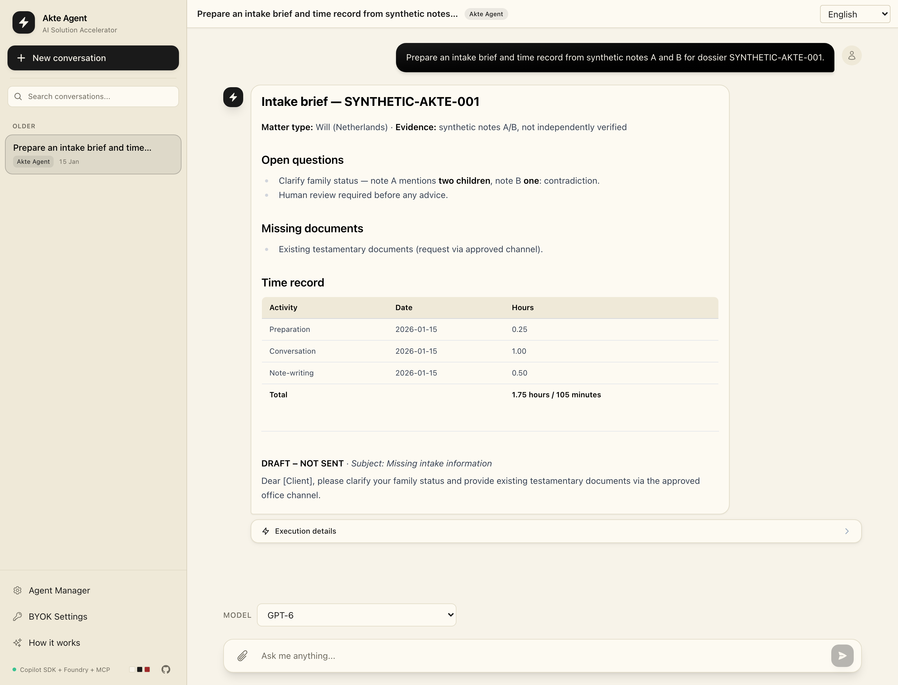
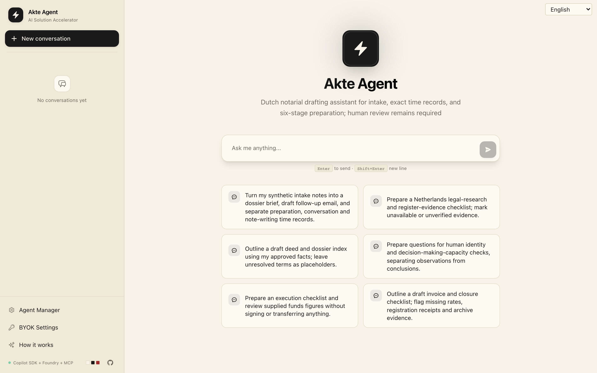

# Akte Agent

Bilingual (English/Dutch) AI assistant for notarial work, running on Azure with Microsoft Foundry and the GitHub Copilot SDK.

> Based on [aiappsgbb/kratos-agent](https://github.com/aiappsgbb/kratos-agent). For architecture, request flow, skills/MCP internals, observability and troubleshooting, see the Kratos repo.

<p align="center">
  
</p>

<p align="center">
  
</p>

<sub>Screenshots use synthetic data.</sub>

## Features

- **Akte Agent persona** — notarial intake, draft follow-ups and exact time records ([intake](docs/akte-intake.md)); execution preparation and client-funds reconciliation ([execution](docs/akte-execution.md)); registration prep, itemized invoice drafts and dossier handoff ([handoff](docs/akte-handoff.md)). Drafts only — official actions stay human.
- **Generic persona** — general-purpose assistant with web search, code interpreter and file downloads.
- **English / Nederlands UI** — language switch keeps conversation, drafts and attachments; agent replies in the selected language.
- **Model picker** — choose the model per conversation; routed sub-agents handle delegated tasks.
- **File sharing** — agent-generated files (CSV, PDF, charts) appear as download links.
- **Signed-in user access (OBO)** — optional MCP server calls Microsoft Graph as the signed-in user.
- **Agent Manager** — edit system prompts, skills, MCP connections and APM packages per persona.
- **Evals & traces** — per-persona eval scenarios and an execution trace viewer, plus live tool/token/latency details per message.
- **Export** — download a persona as a standalone Foundry hosted agent (ZIP with its own `azd up`).

## Deploy to Azure

Prerequisites: [azd](https://learn.microsoft.com/azure/developer/azure-developer-cli/) ≥ 1.28, [Azure CLI](https://learn.microsoft.com/cli/azure/), Node.js 20.9+, Python 3.11+. No local Docker needed (images build in ACR).

1. Clone and sign in:
   ```bash
   git clone https://github.com/pascalvanderheiden/akte-agent && cd akte-agent
   az login && azd auth login
   ```
2. Create an environment:
   ```bash
   azd env new <env-name>
   azd env set DEPLOY_OBO false   # optional: skip the on-behalf-of MCP server
   ```
3. Deploy:
   ```bash
   azd up
   ```
   Pick subscription and region when prompted. At the start you're asked which use-cases to upload — press Enter to skip.
4. Open the app:
   ```bash
   azd env get-value AZURE_STATIC_WEB_APP_URL
   ```
5. Optional — verify the deployment:
   ```bash
   cd .copilot/skills/e2e-smoke && ./run.sh
   ```

Redeploy code only with `azd deploy`; tear down with `azd down`. Optional read-only Azure SRE Agent: see [docs/sre-agent.md](docs/sre-agent.md).

### Diagnose Cosmos persistence after a rollout

Cosmos has public network access disabled. The Container App must reach its
`Sql` private endpoint through the app VNet, with the Cosmos hostname resolving
through the VNet-linked `privatelink.documents.azure.com` private DNS zone to a
**private IP**. A service endpoint or a public DNS answer is not a substitute;
do not open public access or add Cosmos firewall rules to work around a routing
failure. See `infra/modules/cosmos-db.bicep` and `infra/modules/network.bicep`.
The hosted-agent's separate Blob/local-only behavior is described in
[ADR 0002](docs/adr/0002-hosted-agent-local-only-skills.md).

After the network fix is deployed, use the selected `azd` environment to find
the Container App and Application Insights resources (do not commit their names
or endpoints). From **inside the running Container App**, resolve the hostname
in `COSMOS_DB_ENDPOINT` (for example with `az containerapp exec` and Python's
`socket.getaddrinfo`); confirm it returns a private endpoint IP, not a public
address. Check the private endpoint connection, DNS zone link to the app VNet,
and Cosmos public-network setting. The post-deploy `03-chat` smoke checks the
Container App backend's persisted user and assistant messages and rejects
firewall-denial telemetry. It does not verify writes made directly by
Foundry-hosted-agent compute; see the separate limitation in
[the Cosmos persistence runbook](docs/cosmos-persistence.md). For a manual
round-trip, use only synthetic data:

1. In the deployed UI, create a new conversation and send a unique synthetic
   prompt. Wait for a non-empty assistant response, and note the conversation ID.
2. Reload or reopen that conversation so its messages are fetched again from the
   backend. In the browser's Network panel, inspect the response from
   `GET /api/conversations/{conversation_id}/messages`.
3. Confirm the returned JSON contains the exact user prompt with `role: "user"`
   and the non-empty assistant reply with `role: "assistant"`.

Repeat with representative synthetic conversations during the observation
window. Successful HTTP responses alone do **not** prove persistence: writes are
fail-open. If DNS is public, investigate VNet DNS and service-endpoint routing
before changing RBAC. If DNS is private but writes fail, inspect the exception:
firewall/network-denial text (including a 403) is not proof of an RBAC error.

Keep representative synthetic conversations flowing for **30 continuous
minutes after deployment**, including both reads and writes. In the deployed
Application Insights Logs, set explicit UTC start/end timestamps for this
window, allow for ingestion delay, and check the persistence warnings (the
alert in `infra/modules/app-insights.bicep` uses these exact messages):

```kusto
traces
| where timestamp between (datetime(<start-UTC>) .. datetime(<end-UTC>))
| where message in ("Failed to persist user message to Cosmos (non-fatal)",
                    "Failed to persist assistant message to Cosmos (non-fatal)")
| project timestamp, operation_Id, message
```

Search exception details over the same window as well:

```kusto
exceptions
| where timestamp between (datetime(<start-UTC>) .. datetime(<end-UTC>))
| extend error = strcat(outerMessage, " ", tostring(details))
| where error has "Cosmos" and (error has "firewall" or error has "network rules")
| summarize firewall_denials = count()
```

Inspect correlated exception details to distinguish firewall-denial signatures
from RBAC denials; a 403 alone does not distinguish them. If exception details
are not exported to this table, inspect the warning's correlated trace/span
instead. Record **zero firewall-denial traces**, the number of
successful persisted conversations, the window and deployment revision in the
incident, but do not paste raw traces (which may contain identifiers or data)
into the public repo. An empty result without representative traffic or
working telemetry is inconclusive.

Measure latency over the **same** window from individual top-level
`invoke_agent` spans (the duration field is a per-span duration in
`dependencies`/`requests`):

```kusto
union requests, dependencies
| where timestamp between (datetime(<start-UTC>) .. datetime(<end-UTC>))
| where name == "invoke_agent kratos-agent"
| where tostring(customDimensions["gen_ai.operation.name"]) == "invoke_agent"
| summarize arg_max(timestamp, *) by id
| extend duration_s = duration / 1s
| summarize requests = count(), p50_s = percentile(duration_s, 50),
            p95_s = percentile(duration_s, 95)
```

Compare against the pre-rollout incident baseline (p50 **0.111 s**, p95
**0.205 s**). This check requires p95 **under 1 s** and **within 2×** baseline
(at most 0.410 s), not merely under the broader [ADR 0003](docs/adr/0003-interactive-request-latency-budget.md)
budget; do not change that ADR's budget. If there are too few metric samples,
verify telemetry ingestion before drawing conclusions. Correlate slow
operations with Cosmos denial/persistence warnings and their timestamps to
attribute the regression; if the gap remains without denials, open a separate
issue with sanitized, isolated traces and the before/after sample counts.
Track Blob registry-loading authorization failures separately: the local-disk
fallback can mask them, and they are not evidence of healthy Blob access.
This section is a runbook, not evidence that the live checks passed. Keep #138
and #139 open until the post-deployment result is recorded. Track hosted-agent
private networking separately under the platform limitation in ADR 0002; do
not change Cosmos public-network access to work around it.

## Run locally

Runs the backend with SQLite and Azurite instead of Cosmos DB and Blob Storage, and a GitHub Copilot token instead of Foundry models. Requires Docker.

1. Create the config file:
   ```bash
   ./run-local.sh        # Windows: .\run-local.ps1 — first run creates .env.local and exits
   ```
2. Fill in `.env.local`: `COPILOT_GITHUB_TOKEN`, `AZURE_TENANT_ID`, `OBO_API_CLIENT_ID`, `OBO_CLIENT_SECRET`, `ALLOWED_CLIENT_APP_IDS`.
3. Start the backend (http://localhost:8000):
   ```bash
   ./run-local.sh
   ```
4. Start the frontend (http://localhost:3000):
   ```bash
   cd src/frontend && npm install && npm run dev
   ```

Local data lives in `.local/`; edits under `use-cases/` apply immediately.

## Backend CI

Both `CI / backend-lint-test` and `CI Pipeline / Unit Tests` use Python 3.11
and the committed `src/backend/uv.lock`, including the `dev` extra. Dependency
downloads are cached; a stale lockfile fails the install rather than silently
selecting new versions. Reproduce the checks from `src/backend`:

```bash
uv sync --locked --extra dev --python 3.11
uv run --no-sync ruff check app/ tests/
uv run --no-sync ruff format --check app/ tests/
uv run --no-sync mypy app/ --ignore-missing-imports
uv run --no-sync pytest tests/ -v --tb=short
```

Update test doubles when persistence contracts change, and keep workflow
contract tests aligned with intentional trigger changes. CI does not retry or
ignore failing tests.

## License

MIT — inherited from [kratos-agent](https://github.com/aiappsgbb/kratos-agent).
